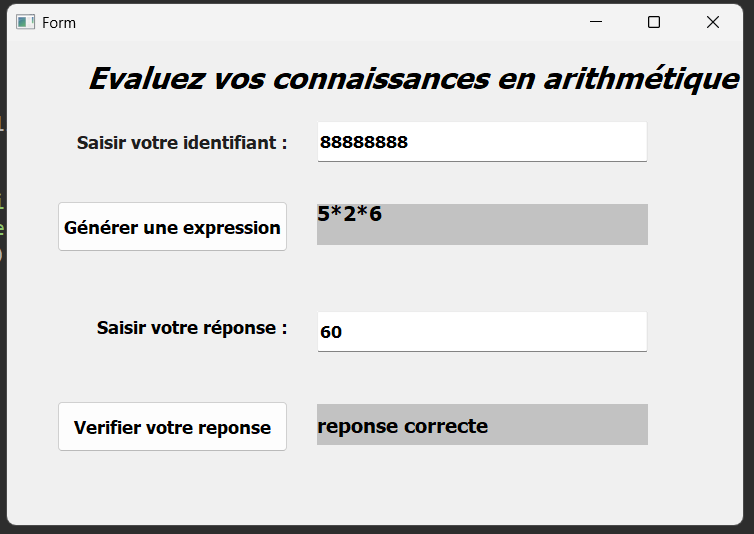

# Arithmetic Practice Application

## Description
This project is a Python GUI application for students to practice arithmetic calculations and for teachers to consult results.  
It uses PyQt5 for the graphical interface.

## Features
- **Student Interface**: Solve arithmetic expressions. Results are saved in a file.
- **Teacher Interface**: View students' responses filtered by operator (+, -, *).

## Requirements
- Python 3.x
- PyQt5

## Files
- `Evaluation.py` : Student interface logic
- `Consultation.py` : Teacher interface logic
- `Expressions.txt` : List of arithmetic expressions
- `Evaluations.dat` : Results file (generated)
- `Interface_Evaluation.ui` : PyQt5 UI for students
- `Interface_Consultation.ui` : PyQt5 UI for teachers

## Screenshots

### Evaluation Interface

### Consultation Interface
